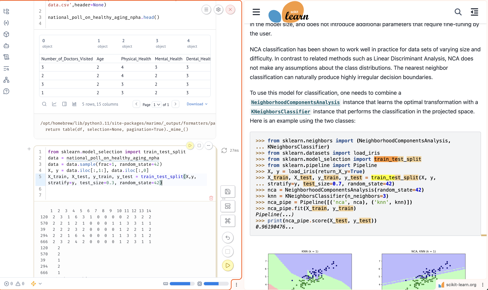

## 8INF887 - Deep Learning
### Autoformation 1 - Perceptron et Adaline
Gabin VRILLAULT - Janvier 2026

Pour lancer le notebook, utiliser la commande suivante dans le terminal dans le repertoire du local:
```bash
python3 -m venv .venv
source .venv/bin/activate
pip install -r requirements.txt
marimo run perceptron.py
```
Votre navigateur devrait s'ouvrir automatiquement et le code devrait s'exécuter pas à pas
en affichant les résultats en Markdown.
Vous pouvez aussi exécuter la commande suivante pour voir le notebook en mode *edit* 
et donc modifier le code/voir tout le code:
```bash
marimo edit perceptron.py
```

### Trace de mon travail



On peut voir à gauche le dataset que j'ai choisi, et que je suis en train de charger dans le notebook marimo.
A droite, on peut voir la documentation de scikit-learn. 